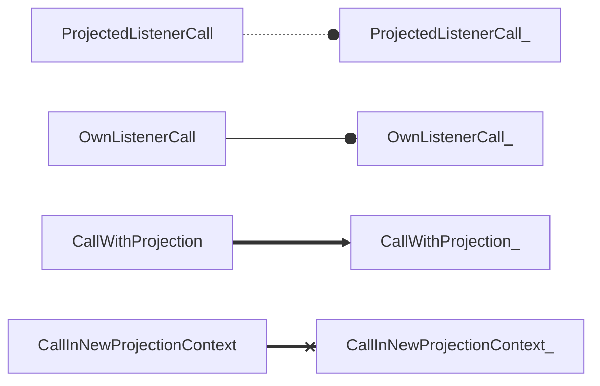
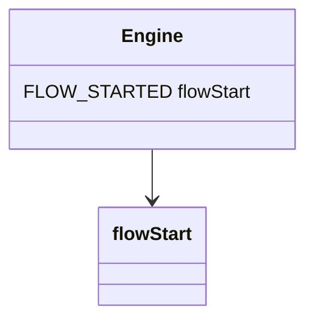
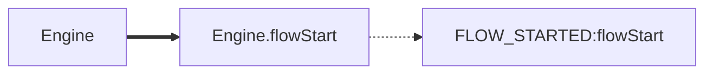
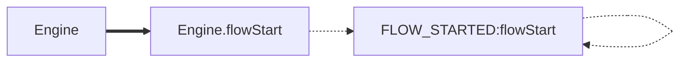
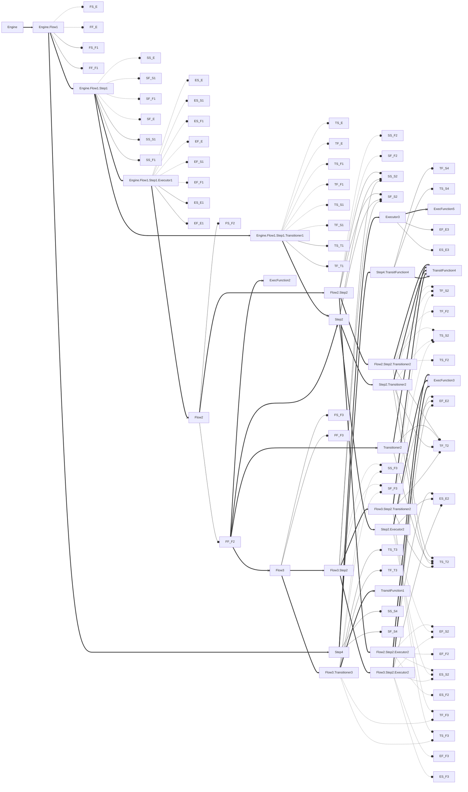

This Markdown document was created with https://stackedit.io. If the viewer of your choice doesn't support features like [mermaid diagrams](https://mermaid-js.github.io/mermaid/#/), please open it on [StackEdit](https://stackedit.io).
# Call graph
The following example shows calls happening as a result of direct invocation of Flow1.

Legend:

N.B.: A Transition function can be called twice in different contexts from the same step, once as Exec and another time as Transit. The two calls would project two different sets of Listeners, and name clash should be avoided in this case.
Possible remedy would be adding a serial, as in `Step.Transit_1`, `Step.Transit_2`.
Also, when Transitioner is used as Executor, both projected Executor events listeners will trigger, as well as Transitioner's own listeners. This is due to the fact that in logical sense the Transitioner will be invoked as an anonymous Flow. 
```
1.     Executor EXECUTOR_STARTED { PROJECTED_ES }
2.       Anonymous FLOW_STARTED { }
3.         Anonymous STEP_STARTED { }
4.           Transitioner TRANSITIONER_STARTED { TS }
5.             ...
6.           Transitioner TRANSITIONER_FINISHED { TF }
7.         Anonymous STEP_FINISHED { }
8.       Anonymous FLOW_FINISHED { }
9.     Executor EXECUTOR_FINISHED { PROJECTED_EF }
```
 

Unexpected Q & A: 
Q1: New projection context vs instantiation by using Engine features from code - former doesn't inherit engine listeners, latter does.
A1: New projection context can't inherit Engine Listeners for a simple reason that Engine listeners would highly likely create loops with called functions.
Example:

The difference in flow present itself as follows:
1) Without Engine context inheritance:

2) With Engine context inheritance:

Since we're obligated to test all possible call indirections to be acyclic, modeling the invocation of all existing functions as Flows would definitely be a part of our check. The example above shows calling of raw function `flowStart` as a standalone Flow. Thus, inheriting Engine context in new projection contexts (like Listener Call) could potentially create call indirection loop situations when no simple remediation by restructuring is possible.
P.S. also, due to "everything is a Flow" semantics, if we indirect it to, say, Exec - in case engine's listeners are projected, not just Exec bindings will trigger. In fact, engine's Flow, Step, Exec and Transit binding will all trigger due to the fact that Exec will be run in the context of anonymous Flow, anonymous Step with anonymous "#exit" Transit attached. I see that as somewhat unexpected, counterintuitive and rarely desirable.

Q2: Providing a custom context in `CallInNewProjectionContext` use case? 
A2: There is no reason for introducing this additional layer of complexity. The way it looks right now - things are flexible enough the way they are. 

Transitioner & ExecBlock - all calls start in new context
ListenerBlock - all calls start in new context


