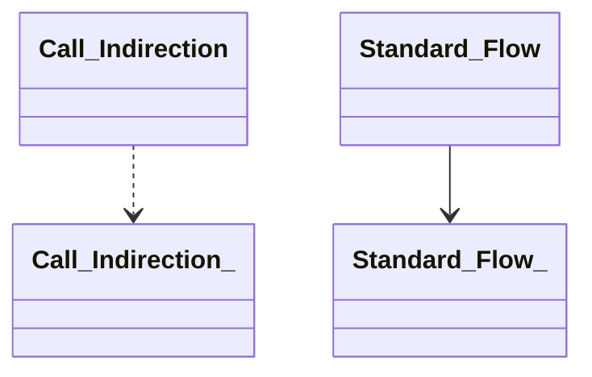
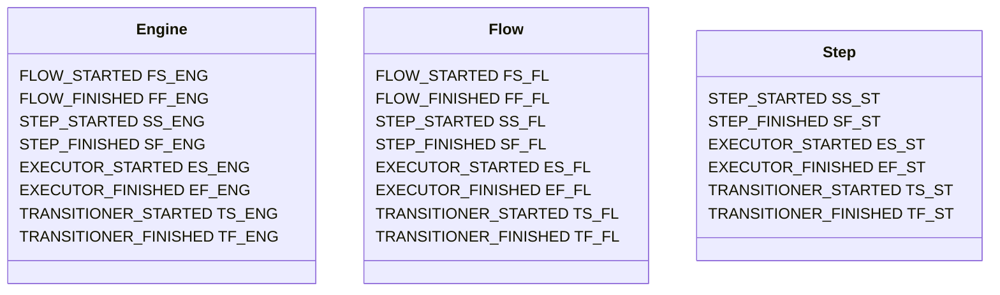
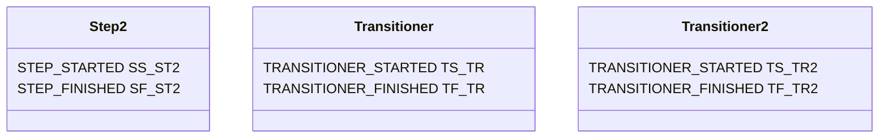
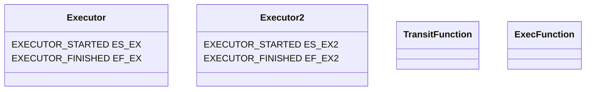

This Markdown document was created with https://stackedit.io. If the viewer of your choice doesn't support features like [mermaid diagrams](https://mermaid-js.github.io/mermaid/#/), please open it on [StackEdit](https://stackedit.io).
# Call graph build rules
This document describes calls performed on different types of functions from different calling contexts.
Werk2 has the following function types: Flow, Step, Exec, Transit, RawFunction.


---
#### Example config:




## 1. Direct instantiation of {Flow} (by Engine)
Engine can directly instantiate all of the following functions: Flow, Step, Exec, Transit, RawFunction as a Flow.

1.1) Flow
```
Flow FLOW_STARTED { FS_ENG, FS_FL }
  ...
Flow FLOW_FINISHED { FF_ENG, FF_FL }
```
1.2) Step
```
Anonymous FLOW_STARTED { FS_ENG }
  Step STEP_STARTED { SS_ENG, SS_ST }
    ... [can either point to itself or to a final state]
  Step STEP_FINISHED { SF_ENG, SF_ST }
Anonymous FLOW_FINISHED { FF_ENG }
```
1.3) Transit
```
Anonymous FLOW_STARTED { FS_ENG }
  Anonymous STEP_STARTED { SS_ENG }
    Transitioner TRANSITIONER_STARTED { TS_ENG, TS_TR }
      ... [can either point to itself or to a final state]
    Transitioner TRANSITIONER_FINISHED { TF_ENG, TF_TR }
  Anonymous STEP_FINISHED { SF_ENG }
Anonymous FLOW_FINISHED { FF_ENG }
```
1.4) Exec
```
Anonymous FLOW_STARTED { FS_ENG }
  Anonymous STEP_STARTED { SS_ENG }
    Executor EXECUTOR_STARTED { ES_ENG, ES_EX }
      ...
    Executor EXECUTOR_FINISHED { EF_ENG, EF_EX }
    Anonymous TRANSITIONER_STARTED { TS_ENG }
      exit(0)
    Anonymous TRANSITIONER_FINISHED { TF_ENG }
  Anonymous STEP_FINISHED { SF_ENG }
Anonymous FLOW_FINISHED { FF_ENG }
```
1.5) Exec RawFunction
```
Anonymous FLOW_STARTED { FS_ENG }
  Anonymous STEP_STARTED { SS_ENG }
    Anonymous EXECUTOR_STARTED { ES_ENG }
      ExecFunction()
    Anonymous EXECUTOR_FINISHED { EF_ENG }
    Anonymous TRANSITIONER_STARTED { TS_ENG }
      exit(0)
    Anonymous TRANSITIONER_FINISHED { TF_ENG }
  Anonymous STEP_FINISHED { SF_ENG }
Anonymous FLOW_FINISHED { FF_ENG }
```
1.6) Transit RawFunction
```
Anonymous FLOW_STARTED { FS_ENG }
  Anonymous STEP_STARTED { SS_ENG }
    Transitioner TRANSITIONER_STARTED { TS_ENG }
      TransitFunction() [can either point to itself or to a final state]
    Transitioner TRANSITIONER_FINISHED { TF_ENG }
  Anonymous STEP_FINISHED { SF_ENG }
Anonymous FLOW_FINISHED { FF_ENG }
```

## 2. Call indirection Flow -> {Step}
Here and below a new context is assumed.
Flow can use functions of type Step, Transit and transit RawFunctions as Steps.

1.1) Step
```
Flow FLOW_STARTED { FS_FL }
  Step STEP_STARTED { SS_FL, SS_ST }
    ...
  Step STEP_FINISHED { SF_FL, SF_ST }
Flow FLOW_FINISHED { FF_FL }
```
1.2) Transit
```
Flow FLOW_STARTED { FS_FL }
  Anonymous STEP_STARTED { SS_FL }
    Transitioner TRANSITIONER_STARTED { TS_FL, TS_TR }
      ...
    Transitioner TRANSITIONER_FINISHED { TF_FL, TF_TR }
  Anonymous STEP_FINISHED { SF_FL }
Flow FLOW_FINISHED { FF_FL }
```
1.3) Transit RawFunction
```
Flow FLOW_STARTED { FS_FL }
  Anonymous STEP_STARTED { SS_FL }
    Anonymous TRANSITIONER_STARTED { TS_FL }
      TransitFunction()
    Anonymous TRANSITIONER_FINISHED { TF_FL }
  Anonymous STEP_FINISHED { SF_FL }
Flow FLOW_FINISHED { FF_FL }
```

## 3. Call indirection Step -> {Exec}
Flow can use functions of all types Flow, Step, Exec, Transit, exec and transit RawFunctions as its Executors.

1.1) Flow
```
Step STEP_STARTED { SS_ST }
  Anonymous EXECUTOR_STARTED { ES_ST }
    --- new context ---
    Flow FLOW_STARTED { FS_FL }
      ...
    Flow FLOW_FINISHED { FF_FL }
    -------------------
  Anonymous EXECUTOR_FINISHED { EF_ST }
  ... [other executors and transitioner defined in Step]
Step STEP_FINISHED { SF_ST }
```
1.2) Step
```
Step STEP_STARTED { SS_ST }
  Anonymous EXECUTOR_STARTED { ES_ST }
    --- new context ---
    Step2 STEP_STARTED { SS_ST2 }
      ... [can either point to itself or to a final state]
    Step2 STEP_FINISHED { SF_ST2 }
    -------------------
  Anonymous EXECUTOR_FINISHED { EF_ST }
  ... [other executors and transitioner defined in Step]
Step STEP_FINISHED { SF_ST }
```
1.3) Exec
```
Step STEP_STARTED { SS_ST }
  Executor EXECUTOR_STARTED { ES_ST, ES_EX }
    ...
  Executor EXECUTOR_FINISHED { EF_ST, EF_EX }
  ... [other executors and transitioner defined in Step]
Step STEP_FINISHED { SF_ST }
```
1.4) Transit
```
Step STEP_STARTED { SS_ST }
  Anonymous EXECUTOR_STARTED { ES_ST }
    --- new context ---
    Transitioner TRANSITIONER_STARTED { TS_TR }
      ... [can either point to itself or to a final state]
    Transitioner TRANSITIONER_FINISHED { TF_TR }
    -------------------
  Anonymous EXECUTOR_FINISHED { EF_ST }
  ... [other executors and transitioner defined in Step]
Step STEP_FINISHED { SF_ST }
```
1.5) Exec RawFunction
```
Step STEP_STARTED { SS_ST }
  Anonymous EXECUTOR_STARTED { ES_ST }
    ExecFunction()
  Anonymous EXECUTOR_FINISHED { EF_ST }
  ... [other executors and transitioner defined in Step]
Step STEP_FINISHED { SF_ST }
```
1.6) Transit RawFunction
```
Step STEP_STARTED { SS_ST }
  Anonymous EXECUTOR_STARTED { ES_ST }
    --- new context ---
    TransitFunction() [can either point to itself or to a final state]
    -------------------
  Anonymous EXECUTOR_FINISHED { EF_ST }
    ... [other executors and transitioner defined in Step]
Step STEP_FINISHED { SF_ST }
```

## 4. Call indirection Step -> {Transit}
Step can use a function of type Step, Transit or transit RawFunctions as its Transitioner.

1.1) Step
```
Step STEP_STARTED { SS_ST }
  ... [executors defined in Step]
  Anonymous TRANSITIONER_STARTED { TS_ST }
    --- new context ---
    Step2 STEP_STARTED { SS_ST2 }
      ... [can point to any step in the flow]
    Step2 STEP_FINISHED { SF_ST2 }
    -------------------
  Anonymous TRANSITIONER_FINISHED { TF_ST }
Step STEP_FINISHED { SF_ST }
```

1.2) Transit
```
Step STEP_STARTED { SS_ST }
  ... [executors defined in Step]
  Transitioner TRANSITIONER_STARTED { TS_ST, TS_TR }
    ...
  Transitioner TRANSITIONER_FINISHED { TF_ST, TF_TR }
Step STEP_FINISHED { SF_ST }
```

1.3) Transit RawFunction
```
Step STEP_STARTED { SS_ST }
  ... [executors defined in Step]
  Anonymous TRANSITIONER_STARTED { TS_ST }
    TransitFunction()
  Anonymous TRANSITIONER_FINISHED { TF_ST }
Step STEP_FINISHED { SF_ST }
```

## 5. Call indirection Exec -> {Exec Function}
Exec can use a function of any type: Flow, Step, Exec, Transit, exec and transit RawFunctions as its underlying Exec function.

1.1) Flow
```
Executor EXECUTOR_STARTED { ES_EX }
  --- new context ---
  Flow FLOW_STARTED { FS_FL }
    ...
  Flow FLOW_FINISHED { FF_FL }
  -------------------
Executor EXECUTOR_FINISHED { EF_EX }
```
1.2) Step
```
Executor EXECUTOR_STARTED { ES_EX }
  --- new context ---
  Step STEP_STARTED { SS_ST }
    ... [can either point to itself or to a final state]
  Step STEP_FINISHED { SF_ST }
  -------------------
Executor EXECUTOR_FINISHED { EF_EX }
```
1.3) Exec
```
Executor EXECUTOR_STARTED { ES_EX }
  --- new context ---
  Executor2 EXECUTOR_STARTED { ES_EX2 }
    ...
  Executor2 EXECUTOR_FINISHED { EF_EX2 }
  -------------------
Executor EXECUTOR_FINISHED { EF_EX }
```
1.4) Transit
```
Executor EXECUTOR_STARTED { ES_EX }
  --- new context ---
  Transitioner TRANSITIONER_STARTED { TS_TR }
    ... [can either point to itself or to a final state]
  Transitioner TRANSITIONER_FINISHED { TF_TR }
  -------------------
Executor EXECUTOR_FINISHED { EF_EX }
```
1.5) Exec RawFunction
```
Executor EXECUTOR_STARTED { ES_EX }
  ExecFunction()
Executor EXECUTOR_FINISHED { EF_EX }
```
1.6) Transit RawFunction
```
Executor EXECUTOR_STARTED { ES_EX }
  --- new context ---
  TransitFunction() [can either point to itself or to a final state]
  -------------------
Executor EXECUTOR_FINISHED { EF_EX }
```

## 6. Call indirection Transit -> Function
Transit can use a function of type Step, Transit, transit RawFunction as its underlying Transit function.

1.1) Step
```
Transitioner TRANSITIONER_STARTED { TS_TR }
  --- new context ---
  Step2 STEP_STARTED { SS_ST2 }
    ... [can point to any step in the flow]
  Step2 STEP_FINISHED { SF_ST2 }
  -------------------
Transitioner TRANSITIONER_FINISHED { TF_TR }
```

1.2) Transit
```
Transitioner TRANSITIONER_STARTED { TS_TR }
  --- new context ---
  Transitioner2 TRANSITIONER_STARTED { TS_TR2 }
    ... [can point to any step in the flow]
  Transitioner2 TRANSITIONER_FINISHED { TF_TR2 }
  -------------------
Transitioner TRANSITIONER_FINISHED { TF_TR }
```

1.3) Transit RawFunction
```
Transitioner TRANSITIONER_STARTED { TS_TR }
  TransitFunction()
Transitioner TRANSITIONER_FINISHED { TF_TR }
```
