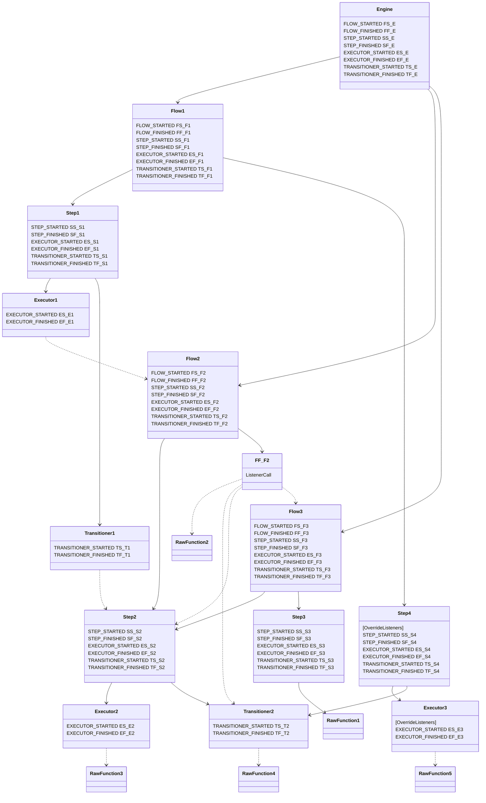
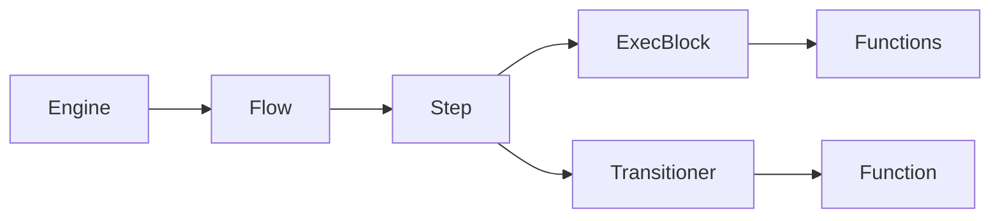

Let's outline the standard flow and listener projection tree.

This shows the direction of the flow and calls, as well as listener projection. It means that listeners defined on the ancestor will be projected onto descendants, unless a descendant sets `overrideListeners` flag.
Engine is a default parent for all directly instantiated flows, i.e. flows that are not called from inside of other flows via indirection, but are explicitly instantiated as root-level flows.

Flexibility:
ExecBlocks and Listeners are comprised of exec functions.
Everything can be used as an exec function - `Flows`, `Steps`, `Execs`, `Transitioners`, `RawFunctions`.
Additionaly, `Steps`, `Transitioners` and `RawTransitFunctions` - can be used as transit functions or steps.
Any exec function can be instantiated by the engine as `Flow` instance.
The difference between `TransitFunctions` and `ExecFunctions` is that transit functions return the following structure that holds information about transition:
Transitioners, Executors, Steps are reusable for direct calls, as well as for indirection - inside ExecBlocks and Listeners.


```
TransitionStatus {
	TransitionType getTransitionType();
	Optional<StepRef> toStep();
	long getDelayMs();
}
```


Let's review the following acyclic configuration and try to emulate invocation of Flow1 with all the subsequent calls and listeners.
As you can see, at different times different functions use different sets of listeners. That depends on actual context of the call. As it was described earlier, Engine-bound listeners are projected on root-level flows and their direct subtrees. 

Listener projection boundary is indirection.

```
1. Flow1 FLOW_STARTED { FS_E, FS_F1 }
2.   Step1 STEP_STARTED { SS_E, SS_F1, SS_S1 }
3.     Executor1 EXECUTOR_STARTED { ES_E, ES_F1, ES_S1, ES_E1 }
4.       Flow2 FLOW_STARTED { FS_E, FS_F2 }
5.         Step2 STEP_STARTED { SS_E, SS_F2, SS_S2 }
6.           Executor2 EXECUTOR_STARTED { ES_E, ES_F2, ES_S2, ES_E2 }
7.             RawFunction3()
8.           Executor2 EXECUTOR_FINISHED { EF_E, EF_F2, EF_S2, EF_E2 }
9.           Transitioner2 TRANSITIONER_STARTED { TS_E, TS_F2, TS_S2, TS_T2 }
10.             RawFunction4()
11.           Transitioner2 TRANSITIONER_FINISHED { TF_E, TF_F2, TF_S2, TF_T2 }
12.         Step2 STEP_FINISHED { SF_E, SF_F2, SF_S2 }
13.       Flow2 FLOW_FINISHED { FF_E, FF_F2 }
14.         FF_F2 (listener begin)
15.           RawFunction2()
16.           Transitioner2 TRANSITIONER_STARTED { TS_T2 }
17.             RawFunction4()
18.           Transitioner2 TRANSITIONER_FINISHED { TF_T2 }
19.           Step2 STEP_STARTED { SS_S2 }
20.             Executor2 EXECUTOR_STARTED { ES_S2, ES_E2 }
21.               RawFunction3()
22.             Executor2 EXECUTOR_FINISHED { EF_S2, EF_E2 }
23.             Transitioner2 TRANSITIONER_STARTED { TS_S2, TS_T2 }
24.               RawFunction4()
25.             Transitioner2 TRANSITIONER_FINISHED { TF_S2, TF_T2 }
26.           Step2 STEP_FINISHED { SF_S2 }
27.           Flow3 FLOW_STARTED { FS_F3 }
28.             Step2 STEP_STARTED { SS_F3, SS_S2 }
29.               Executor2 EXECUTOR_STARTED { ES_F3, ES_S2, ES_E2 }
30.                 RawFunction3()
31.               Executor2 EXECUTOR_FINISHED { EF_F3, EF_S2, EF_E2 }
32.               Transitioner2 TRANSITIONER_STARTED { TS_F3, TS_S2, TS_T2 }
33.                 RawFunction4()
34.               Transitioner2 TRANSITIONER_FINISHED { TF_F3, TF_S2, TF_T2 }
35.             Step2 STEP_FINISHED { SF_F3, SF_S2 }
36.             Step3 STEP_STARTED { SS_F3, SS_S3 }
37.               Anonymous TRANSITIONER_STARTED { TS_F3, TS_S3 }
38.                 RawFunction1()
39.               Anonymous TRANSITIONER_FINISHED { TF_F3, TF_S3 }
40.             Step3 STEP_FINISHED { SF_F3, SF_S3 }
41.           Flow3 FLOW_FINISHED { FF_F3 }
42.         FF_F2 (listener end)
43.       Flow2 FLOW_FINISHED (all listeners finished)
44.     Executor1 EXECUTOR_FINISHED { ES_E, ES_F1, ES_S1, ES_E1 }
45.     Transitioner1 TRANSITIONER_STARTED { TS_E, TS_F1, TS_S1, TS_T1 }
46.       Step2 STEP_STARTED { SS_S2 }
47.         Executor2 EXECUTOR_STARTED { ES_S2, ES_E2 }
48.           RawFunction3()
49.         Executor2 EXECUTOR_FINISHED { EF_S2, EF_E2 }
50.         Transitioner2 TRANSITIONER_STARTED { TS_S2, TS_T2 }
51.           RawFunction4()
52.         Transitioner2 TRANSITIONER_FINISHED { TF_S2, TF_T2 }
53.       Step2 STEP_FINISHED { SF_S2 }
54.     Transitioner1 TRANSITIONER_FINISHED { TF_E, TF_F1, TF_S1, TF_T1 }
55.   Step1 STEP_FINISHED { SF_E, SF_F1, SF_S1 }
56.   Step4 STEP_STARTED { SS_S4 }
57.     Executor3 EXECUTOR_STARTED { ES_E3 }
58.       RawFunction5()
59.     Executor3 EXECUTOR_FINISHED { EF_E3 }
60.     Transitioner2 TRANSITIONER_STARTED { TS_S4, TS_T2 }
61.       RawFunction4()
62.     Transitioner2 TRANSITIONER_FINISHED { TF_S4, TF_T2 }
63.   Step4 STEP_FINISHED { SF_S4 }
64. Flow1 FLOW_FINISHED { FF_E, FF_F1 }
```

