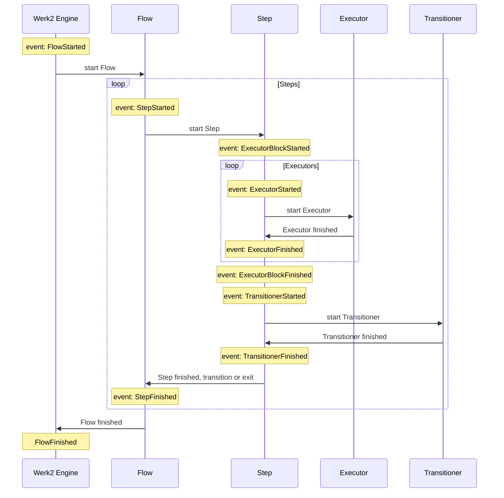
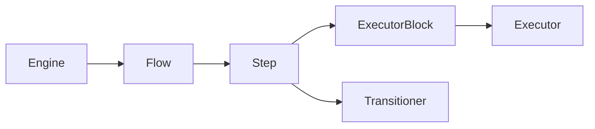
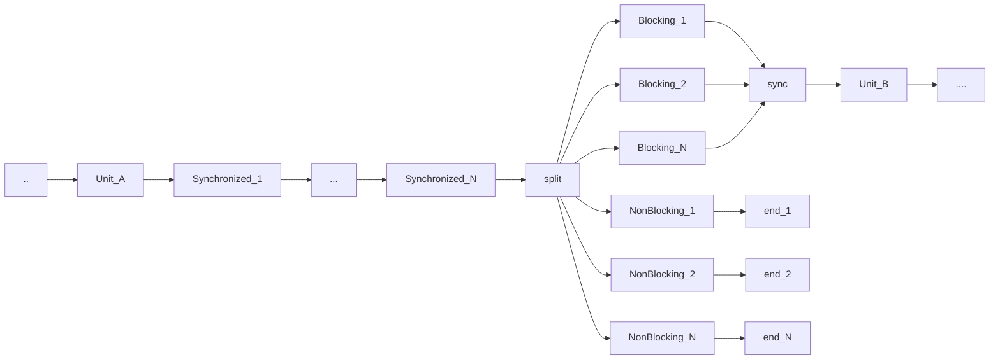

This Markdown document was created with https://stackedit.io. If the viewer of your choice doesn't support features like [mermaid diagrams](https://mermaid-js.github.io/mermaid/#/), please open it on [StackEdit](https://stackedit.io).
# Werk2 configuration
This document defines configuration structures that define Werk2 flows and execution.

## Flow state events and listeners
The following diagram shows common Flow processing loop.

Below are the FlowStateEvents by level for which FlowStateEventListeners could be created and defined:

    Engine-level: no events
    Flow-level: FlowStarted, FlowFinished
    Step-level: StepStarted, StepFinished
    ExecutorBlock-level: ExecutorBlockStarted, ExecutorBlockFinished
    Executor-level: ExecutorStarted, ExecutorFinished
    Executor-level: TransitionerStarted, TransitionerFinished
Definition hierarchy is as the following: 

Listeners can be defined on different levels of hierarchy, i.e. `Step-level` can contain definitions that will be used by all underlying `Executors` and `Transitioners`, `Flow-level` can bind listeners to all underlying `Steps`, `Executors` and `Transitioners`. In other words, each level of hierarchy can bind listeners to its events and to events on lower levels. In practical sense it allows to easily define a variety of logic, notably logging, monitoring, or Flow Persistence. Importantly, in Werk2 Flow Persistence is not a first-class citizen, but simply a set of blocking listeners.   

All listeners defined on all levels will be called upon event, unless a listener is not defined as `unique`. `Unique` listeners will be called once per event, even if bound multiple times.
`Unique` means uniqueness not just for the function name, but also for the call.
Listeners by default are `non-blocking`, i.e. execution of next `unit`, if any, will start concurrently with execution of listeners. `Non-blocking` listeners can't affect (e.g. halt) execution of the flow.
A listener can be configured as `blocking`, which would mean next `unit` won't start before such listener returns. `Blocking` listeners are still executed in parallel with other `blocking` and `non-blocking` listeners. `Blocking` listeners may be configured to abort the execution of a Flow upon returning certain output.
A listener can be configured as `synchronized`, which means other listeners will not be executed concurrently with it.

Unsolved Questions:
- Engine-level definitions are defined on server instance and are not portable with flows, should they be allowed? 
It can be useful for implicit monitoring/sending metrics/logging.
How about: Flow Persistence without Flow being aware of it. But that can cause havoc in RuntimeParameters, if Flows are not expecting to be persisted and recovered with loss of all of their RuntimeParameters. Perhaps better solution for Flow Persistence would be Flow Inheritance that would allow to append to/override parts of the superflow, in that way persistence listeners may be added in a visible manner.
- Should it be allowed to force override on lower levels to ignore higher-level listener definitions? E.g. ExecutorStarted event configured as override for a particular Executor will result in Listeners defined on higher level not be called.

Flow of listeners looks like the following:

By `unit` I mean a synchronous executable block - either an Executor, a Transitioner or a block of Listeners bound to the same event. At any given moment in time only one such unit may exists and is be executed per Flow.

## Fields and visibility
There are two types of fields - Serializable Fields and Runtime Fields.
Serialization of flows can be useful for a few reasons, including moving Flow instances between servers and persisting flow instances in Storage.
Serializable Fields are restricted to types and structure mimicking JSON structure, but not equivalent to JSON document due to the fact that the actual serialization for persistence may vary. Typing of Serializable Fields is obvious from the following enumeration.

    public enum FieldType {
    	LONG,
    	DOUBLE,
    	BOOL,
    	STRING,
    	
    	LIST,
    	MAP
    }

Runtime Fields can be of any type allowed in underlying language, including the types that are associated with Serializable Fields. The difference between the two is that Fields marked as Serializable will be serialized, while Runtime Fields will be omitted and therefore lost.

Visibility can be explained by analogy using the following example in Java, where classes Flow, Step, Executor and Transitioner denote Werk2 entities:

    public class Flow {
    	//Can only see own (Flow) Fields
    	int flow_int = 15;
    	boolean flow_bool = true;
    	
    	//Cannot do this
    	//int flow_int2 = step_int;
    	
    	class Step {
    		//Can see Flow and own (Step) Fields
    		int step_int = flow_int;
    		boolean step_bool = false;
    		
    		//Cannot do this
    		//int step_int2 = executor1_int;
    		//int step_int2 = executor2_int;
    		//int step_int2 = transitioner_int;
    		
    		class Executor1 {
    			//Can see Flow, Step and own (Executor1) Fields
    			int executor1_int = flow_int;
    			boolean executor1_bool= step_bool;
    			
    			//Cannot do this:
    			//int executor1_int2 = executor2_int;
    			//int executor1_int2 = transitioner_int;
    		}
    		
    		class Executor2 {
    			//Can see Flow, Step and own (Executor2) Fields
    			int executor2_int = step_int;
    			boolean executor2_bool= flow_bool;
    			
    			//Cannot do this:
    			//int executor2_int2 = executor1_int;
    			//int executor2_int2 = transitioner_int;
    		}
    		
    		class Transitioner {
    			//Can see Flow, Step and own (Transitioner) Fields
    			int transitioner_int = step_int;
    			boolean transitioner_bool= flow_bool;
    			
    			//Cannot do this:
    			//int transitioner_int2 = executor1_int;
    			//int transitioner_int2 = executor2_int2;
    		}
    	}
    }

Visibility of Fields to Listeners depends on the level of corresponding event.

## Function calls
All Werk2 entities, which are - Flow, Step, Executor, Transitioner and Listener - are parametrized functions that return integer status. They define one or more call signatures, i.e. input parameters and output parameters.
Werk2 configuration defines signatures for all entities, and when entity becomes a part of composition - the actual call. E.g. if an Executor1 has the following signature: 
`executor1(in: int i1, int i2, String s; out: boolean b, List l);`
and Executor1 is a part of Step1, Step1 should define how exactly Executor1 will be called in its context, along the lines of:
`Step1.exec1Code = executor1(in: Step1.num1, 35, Step1.description; out: Step1.isExec1Successful, Step1.exec1Findings);`
As you can see, input parameters may be set to caller's fields or constants.
One special type of constants is "STEP_NAME", which takes a pre-validated step name to perform transitions. It's value should be validated on engine load.
TODO: Ideally step name should be injected from Flow level? again, Ideally Step shouldn't know anything about other Steps.

Setting input parameters means de facto initializing corresponding callee's fields to those values. When a function call returns, values of output parameters and status can be used to set caller's fields. Thus, from perspective of implementation there is no "parameters" in physical sense, just values of fields of callee are being assigned values of caller's fields before call, and the other way around after the call is done.
The same Field assignment procedure will be performed when a Flow start a Step, but the difference would be that no code will be executed, because Step by itself is a composite entity. And, finally, Flow's fields are assigned once on creation of Flow instance by an external actor.
Non-Blocking Listeners can't have out parameters and their status code is always ignored.
Blocking and Synchronized Listeners can be configured to abort their Flow Instance on returning a certain status, as well as set/update parameters of a corresponding Entity.
