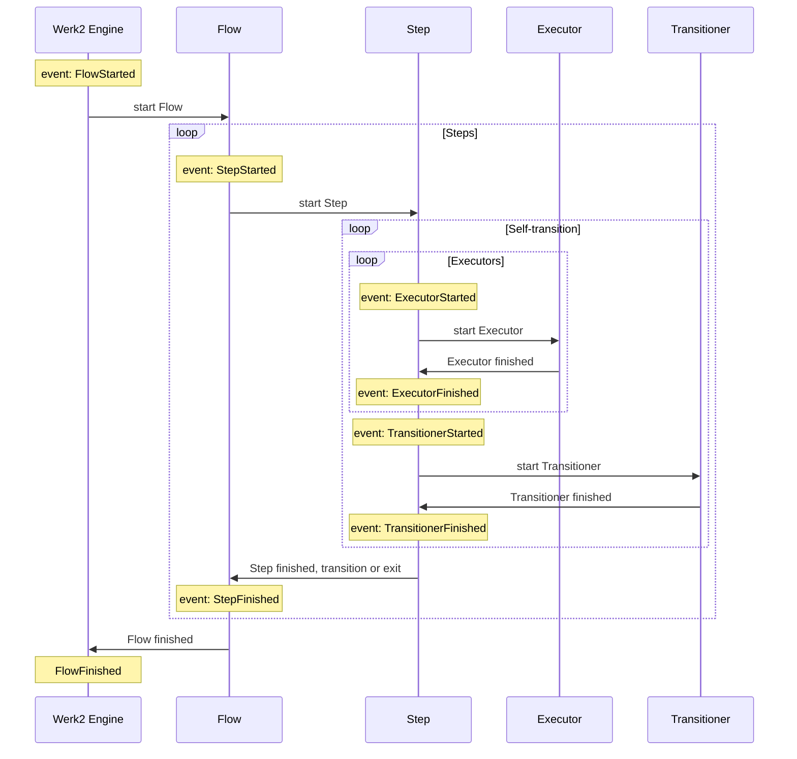
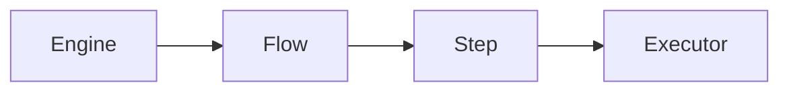
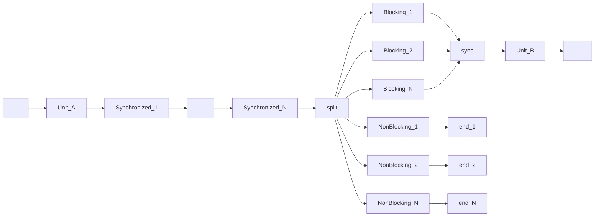

This Markdown document was created with https://stackedit.io. If the viewer of your choice doesn't support features like [mermaid diagrams](https://mermaid-js.github.io/mermaid/#/), please open it on [StackEdit](https://stackedit.io).
# Werk2 configuration
This document defines configuration structures that define Werk2 flows and execution.

## Flow state events and listeners
The following diagram shows common Flow processing loop.

Below are the FlowStateEvents by level for which FlowStateEventListeners could be created and defined:

    Engine-level: no events
    Flow-level: FlowStarted, FlowFinished
    Step-level: StepStarted, StepFinished
    Executor-level: ExecutorStarted, ExecutorFinished
    Executor-level: TransitionerStarted, TransitionerFinished
Definition hierarchy looks as the following: 

Listeners can be defined on different levels of hierarchy, i.e. `Step-level` can contain definitions that will be used by all underlying `Executors` and `Transitioners`, `Flow-level` can bind listeners to all underlying `Steps`, `Executors` and `Transitioners`. In other words, each level of hierarchy can bind listeners to its events and to events on lower levels. In practical sense it allows to easily define a variety of logic, notably logging, monitoring, or Flow Persistence. Importantly, in Werk2 Flow Persistence is not a first-class citizen, but simply a set of blocking listeners.   

All listeners defined on all levels will be called upon event, unless a listener is not defined as `unique`. `Unique` listeners will be called once per event, even if bound multiple times.
`Unique` means uniqueness not just for the function name, but also for the call.
Listeners by default are `non-blocking`, i.e. execution of next `unit`, if any, will start concurrently with execution of listeners. `Non-blocking` listeners can't affect (e.g. halt) execution of the flow.
A listener can be configured as `blocking`, which would mean next `unit` won't start before such listener returns. `Blocking` listeners are still executed in parallel with other `blocking` and `non-blocking` listeners. `Blocking` listeners may be configured to abort the execution of a Flow upon returning certain output.
A listener can be configured as `synchronized`, which means other listeners will not be executed concurrently with it.

Unsolved Questions:
- Engine-level definitions are defined on server instance and are not portable with flows, should they be allowed? 
It can be useful for implicit monitoring/sending metrics/logging.
How about: Flow Persistence without Flow being aware of it. But that can cause havoc in RuntimeParameters, if Flows are not expecting to be persisted and recovered with loss of all of their RuntimeParameters. Perhaps better solution for Flow Persistence would be Flow Inheritance that would allow to append to/override parts of the superflow, in that way persistence listeners may be added in a visible manner.
- Should it be allowed to force override on lower levels to ignore higher-level listener definitions? E.g. ExecutorStarted event configured as override for a particular Executor will result in Listeners defined on higher level not be called.

Flow of listeners looks like the following:

By `unit` I mean a synchronous executable block - either an Executor, a Transitioner or a block of Listeners bound to the same event.

## Parameters and visibility
There are two types of parameters - Serializable and Runtime.
Serialization of flows can be useful for a few reasons, including moving Flow instances between servers and persisting flow instances in Storage.
Serializable are restricted to types and structure mimicking JSON structure, but not equivalent to JSON due to the fact that the actual serialization for persistence may vary.

