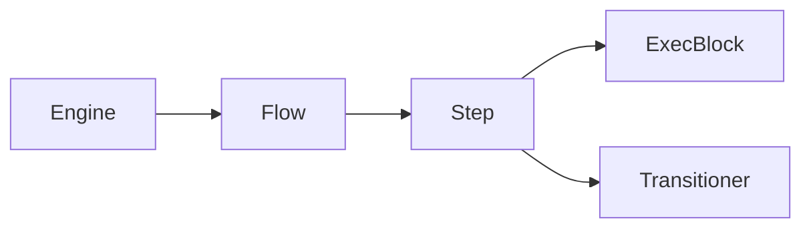
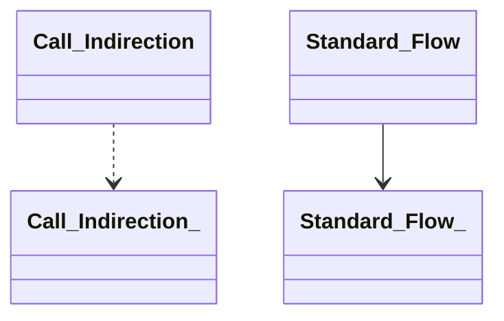
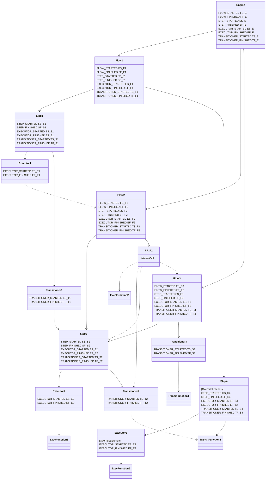
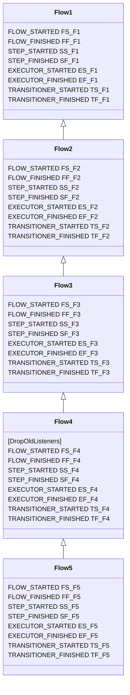
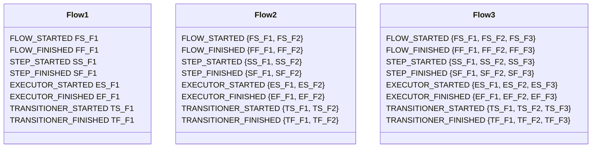
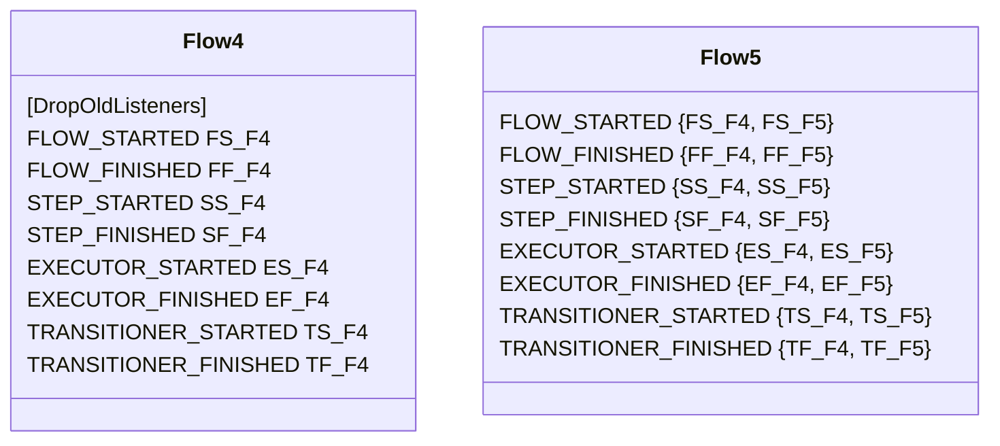

This Markdown document was created with https://stackedit.io. If the viewer of your choice doesn't support features like [mermaid diagrams](https://mermaid-js.github.io/mermaid/#/), please open it on [StackEdit](https://stackedit.io).
# Functions, Listener Projection and Listener Inheritance with examples
Let's look at the standard flow and listener projection tree.

This shows the standard flow execution, which coincides with the direction of listener projection. It means that listeners defined on the ancestor level will be projected onto all descendants, unless a descendant sets `overrideListeners` flag. 
The projection rules are pretty obvious from the diagram. For example, if there is a STEP_STARTED listener defined on Flow level, all Steps of that flow will run the listener on execution startup. Similarly, if there is an EXECUTOR_STARTED listener defined on Flow level - all Execs of all Steps of that Flow will run it before execution. If another EXECUTOR_STARTED listener will be defined on Step level, it will only apply to that Step's executors.

All config entities are functions - namely `Flows`, `Steps`, `Execs`, `Transitioners` and `RawFunctions`.
There are two types of functions: `Exec Functions` and `Transit Functions`.
The difference between `TransitFunctions` and `ExecFunctions` is that Exec Functions return either an execution code or a pair of code and message, while Transit Functions return not only code and message but also a `TransitionStatus` structure that holds information about Step transition:
```
TransitionStatus {
	TransitionType getTransitionType();
	Optional<StepRef> toStep();
	long getDelayMs();
}
```
Since Transit Function return type is a superset of Exec Function return type, Transit Functions can be used as Exec functions, but not conversely. In other words, a Transit Function is an Exec Function, but not the other way around.
`Flows`, `Execs` and `RawExecFunctions` are Exec Functions.
`Steps`, `Transitioners` and `RawTransitFunctions` are Transit Functions.
All Functions can be used for direct calls, as well as for indirection - inside ExecBlocks and Listeners.
"Usable for direct calls" means that all Functions (which includes Transit Functions) can be run by Werk Engines as `Flow` instances.
Additionally, Transit Functions can be used as either Transits or Steps.

Engine is a default listener projection parent for all directly instantiated Flows, i.e. Flows that are not referred from inside of other entities via call indirection, but are explicitly instantiated as root-level Flows.
Engine is not a listener projection parent for Flows that are referred via call indirection, e.g. from ExecBlock or ListenerBlock. Call indirection is effectively a Listener Projection boundary, i.e. Listener Projection is independent on each indirection level.
For example, if a Step is called as a function from Executioner, Listeners defined in the Flow that Executioner belongs to will not be applied to said Step or its descendants through the indirection boundary. However, the Step's own bindings for underlying Execs and Transits will be applied. Furthermore, if one of Step's Execs or Transits, in its turn, is using indirection to call another Flow or Step, there will be no Listener projection over that call indirection boundary either.
More examples are presented below.

## Example: configuration and flow
#### Legend:

---
#### Example config:

---
Let's review the configuration shown above and try to emulate direct invocation of `Flow1` with all the subsequent calls and listeners.
The order of invocation (with listeners) will be as follows:
```
1. Flow1 FLOW_STARTED { FS_E, FS_F1 }
2.   Step1 STEP_STARTED { SS_E, SS_F1, SS_S1 }
3.     Executor1 EXECUTOR_STARTED { ES_E, ES_F1, ES_S1, ES_E1 }
4.       Flow2 FLOW_STARTED { FS_F2 }
5.         Step2 STEP_STARTED { SS_F2, SS_S2 }
6.           Executor2 EXECUTOR_STARTED { ES_F2, ES_S2, ES_E2 }
7.             ExecFunction3()
8.           Executor2 EXECUTOR_FINISHED { EF_F2, EF_S2, EF_E2 }
9.           Transitioner2 TRANSITIONER_STARTED { TS_F2, TS_S2, TS_T2 }
10.             TransitFunction4()
11.           Transitioner2 TRANSITIONER_FINISHED { TF_F2, TF_S2, TF_T2 }
12.         Step2 STEP_FINISHED { SF_F2, SF_S2 }
13.       Flow2 FLOW_FINISHED { FF_F2 }
14.         FF_F2 (listener begin)
15.           ExecFunction2()
16.           Transitioner2 TRANSITIONER_STARTED { TS_T2 }
17.             TransitFunction4()
18.           Transitioner2 TRANSITIONER_FINISHED { TF_T2 }
19.           Step2 STEP_STARTED { SS_S2 }
20.             Executor2 EXECUTOR_STARTED { ES_S2, ES_E2 }
21.               ExecFunction3()
22.             Executor2 EXECUTOR_FINISHED { EF_S2, EF_E2 }
23.             Transitioner2 TRANSITIONER_STARTED { TS_S2, TS_T2 }
24.               TransitFunction4()
25.             Transitioner2 TRANSITIONER_FINISHED { TF_S2, TF_T2 }
26.           Step2 STEP_FINISHED { SF_S2 }
27.           Flow3 FLOW_STARTED { FS_F3 }
28.             Step2 STEP_STARTED { SS_F3, SS_S2 }
29.               Executor2 EXECUTOR_STARTED { ES_F3, ES_S2, ES_E2 }
30.                 ExecFunction3()
31.               Executor2 EXECUTOR_FINISHED { EF_F3, EF_S2, EF_E2 }
32.               Transitioner2 TRANSITIONER_STARTED { TS_F3, TS_S2, TS_T2 }
33.                 TransitFunction4()
34.               Transitioner2 TRANSITIONER_FINISHED { TF_F3, TF_S2, TF_T2 }
35.             Step2 STEP_FINISHED { SF_F3, SF_S2 }
36.             Anonymous STEP_STARTED { SS_F3 }
37.               Transitioner3 TRANSITIONER_STARTED { TS_F3, TS_T3 }
38.                 TransitFunction1()
39.               Transitioner3 TRANSITIONER_FINISHED { TF_F3, TF_T3 }
40.             Anonymous STEP_FINISHED { SF_F3 }
41.           Flow3 FLOW_FINISHED { FF_F3 }
42.         FF_F2 (listener end)
43.       Flow2 FLOW_FINISHED (all listeners finished)
44.     Executor1 EXECUTOR_FINISHED { ES_E, ES_F1, ES_S1, ES_E1 }
45.     Transitioner1 TRANSITIONER_STARTED { TS_E, TS_F1, TS_S1, TS_T1 }
46.       Step2 STEP_STARTED { SS_S2 }
47.         Executor2 EXECUTOR_STARTED { ES_S2, ES_E2 }
48.           ExecFunction3()
49.         Executor2 EXECUTOR_FINISHED { EF_S2, EF_E2 }
50.         Transitioner2 TRANSITIONER_STARTED { TS_S2, TS_T2 }
51.           TransitFunction4()
52.         Transitioner2 TRANSITIONER_FINISHED { TF_S2, TF_T2 }
53.       Step2 STEP_FINISHED { SF_S2 }
54.     Transitioner1 TRANSITIONER_FINISHED { TF_E, TF_F1, TF_S1, TF_T1 }
55.   Step1 STEP_FINISHED { SF_E, SF_F1, SF_S1 }
56.   Step4 STEP_STARTED { SS_S4 }
57.     Executor3 EXECUTOR_STARTED { ES_E3 }
58.       ExecFunction5()
59.     Executor3 EXECUTOR_FINISHED { EF_E3 }
60.     Anonymous TRANSITIONER_STARTED { TS_S4 }
61.       TransitFunction4()
62.     Anonymous TRANSITIONER_FINISHED { TF_S4 }
63.   Step4 STEP_FINISHED { SF_S4 }
64. Flow1 FLOW_FINISHED { FF_E, FF_F1 }
```

As you can see, functions use different sets of listeners at different times. This behavior is explainable by the rules of call indirection and application of Engine listeners shown above.
Let's do a dive deep and provide explanations for all calls and listener projections.

- Lines 1-3: `Flow1` starts `Step1` starts `Executor1`. Listeners are projected accordingly starting from Engine level, since the Flow is directly instantiated by the Engine.
- Lines 4-13: `Executor1` uses call indirection to invoke `Flow2` as a function. `Flow2` starts `Step2` starts `Executor2` and `Transitioner2`. Listeners are projected within this call context, but since `Flow1` is called by indirection, Engine's listeners are not applied.
- Lines 14-42: Registered Listener `FF_F2` triggers on `FLOW_FINISHED` event. This listener is using call indirection to invoke `ExecFunction2`, `Transitioner2`, `Step2` and `Flow3`. All these calls happen in separate Listener Projection contexts. 
Thus, `ExecFunction2` has no listeners inherited because it has not ancestors and by itself, being a `RawFunction`, doesn't define any listeners.
`Transitioner2` is called in 3 different contexts: 1) its own context, 2) context of `Step2` and 3) context of `Flow3`. From the listing above you can see, that in (1) it uses its own listeners, while in (2) `Step2`'s listeners are projected, and in (3) all listeners of `Flow3` and `Step2` are projected.
- Also note that on lines 36-40 that an Anonymous step is used. It happens because Flow3 is using `Transitioner3` directly as its Step, which is allowed due to the fact that it's a Transit function.
- Lines 45-54: `Transitioner1` uses call indirection to invoke `Step2`, since Step is a Transit Function. That creates a separate Listener Projection context in which `Step2` is calling `Executor2` and `Transitioner2` .
- Line 55: `Step1` has finished.
- Lines 56-63:  Now `Flow1` calls `Step4`, which in its turn calls `Executor3` and `TransitFunction4`.
An important thing to note about `Step4` and `Executor3` is that both have `OverrideListeners` flag set, which means they ignore projected listeners from ancestor levels. However, even with that flag their own listeners are still projected to their descendants. That's why for both `Step4` and `Executor3` only their own listeners are being used. At the same time, `TS_S4` and `TF_S4` listeners, defined at `STEP4` for `TRANSITIONER_STARTED` and `TRANSITIONER_FINISHED` events, correspondingly, are still projected to anonymous `Transitioner` wrapping raw `TransitFunction4`.
- Line 64: `Flow1` is finished.

Example: Engine directly running Step2 as a Flow:
```
01. Anonymous FLOW_STARTED { FS_E }
02.   Step2 STEP_STARTED { SS_E, SS_S2 }
03.     Executor2 EXECUTOR_STARTED { ES_E, ES_S2, ES_E2 }
04.       ExecFunction3()
05.     Executor2 EXECUTOR_FINISHED { EF_E, EF_S2, EF_E2 }
06.     Transitioner2 TRANSITIONER_STARTED { TS_E, TS_S2, TS_T2 }
07.       TransitFunction4()
08.     Transitioner2 TRANSITIONER_FINISHED { TF_E, TF_S2, TF_T2 }
09.   Step2 STEP_FINISHED { SF_E, SF_S2 }
10. Anonymous FLOW_FINISHED { FF_E }
```

Example: Engine directly running raw ExecFunction3 as a Flow:
```
01. Anonymous FLOW_STARTED { FS_E }
02.   Anonymous STEP_STARTED { SS_E }
03.     Anonymous EXECUTOR_STARTED { ES_E }
04.       ExecFunction3()
05.     Anonymous EXECUTOR_FINISHED { EF_E }
06.     Anonymous TRANSITIONER_STARTED { TS_E }
07.       WerkNoOpTransitFunction()
08.     Anonymous TRANSITIONER_FINISHED { TF_E }
09.   Anonymous STEP_FINISHED { SF_E }
10. Anonymous FLOW_FINISHED { FF_E }
```

Example: Engine directly running raw TransitFunction4 as a Flow:
```
01. Anonymous FLOW_STARTED { FS_E }
02.   Anonymous STEP_STARTED { SS_E }
03.     Anonymous TRANSITIONER_STARTED { TS_E }
04.       TransitFunction4()
05.     Anonymous TRANSITIONER_FINISHED { TF_E }
06.   Anonymous STEP_FINISHED { SF_E }
07. Anonymous FLOW_FINISHED { FF_E }
```

## Extended Flows and Steps: Listener Inheritance
Another feature supported by Werk is `Step` and `Flow` extension. In the context of Listener projection we can think similarly of both `ExtendedStep` and `ExtendedFlow`.
The properties of interest are:
```
Extended (Step or Flow) {
    ...
    List<ListenerCall> addListeners;
    Boolean dropOldListeners;
    ...
}
```
The idea is pretty simple here:
Adding Listeners to `addListeners` list allows to extend original set of listeners defined on SuperStep/SuperFlow level. If the flag `dropOldListeners` is set, instead of extending the list defined on upper levels it's being overridden, i.e. only listeners defined in `addListeners` collection will be applied to the subclass.
This mechanism is listener inheritance and is completely orthogonal to listener projection.
A simple way to think about listener inheritance is to view it as a purely logical concept, and in reality after configuration initialization there is no shared context per se between `Flows` and `ExtendedFlows `, and `Steps` and `ExtendedSteps`. In fact, any inheritance is getting denormalized into individual Flow and Step configurations, an example of which is shown below. Therefore, there is no clashing or ambiguity with listener projection model to speak of.
Having an idea of how this denormalization works is helpful to understand that in fact Listener Inheritance is completely decoupled from Listener Projection.
Please note how all inherited listeners are overridden at `Flow4`, while `Flow5` inherits only listeners of `Flow4`. 
Listener inheritance for Steps works exactly in the same way.

---
#### Inheritance


---
#### Denormalized (same structure):




